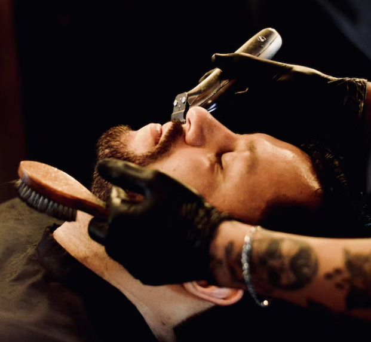

<!DOCTYPE html>
<html lang="en">
<head>
    <meta charset="UTF-8">
    <meta http-equiv="X-UA-Compatible" content="IE=edge">
    <meta name="viewport" content="width=device-width, initial-scale=1.0">
    <title>Barbero - We will make the style of your dreams</title>

    <link rel="stylesheet" href="https://cdnjs.cloudflare.com/ajax/libs/font-awesome/6.1.2/css/all.min.css" integrity="sha512-1sCRPdkRXhBV2PBLUdRb4tMg1w2YPf37qatUFeS7zlBy7jJI8Lf4VHwWfZZfpXtYSLy85pkm9GaYVYMfw5BC1A==" crossorigin="anonymous" referrerpolicy="no-referrer">
   <link rel="stylesheet" href="css/style.css">
    

    <link rel="preconnect" href="https://fonts.googleapis.com">
    <link rel="preconnect" href="https://fonts.gstatic.com" crossorigin>
    <link href="https://fonts.googleapis.com/css2?family=Barlow+Semi+Condensed:wght@200;400;500;600;800&family=Poppins:wght@200;400;500;600;800&display=swap" rel="stylesheet">
    </head>
<body>

    <header>
        

            <nav>
                

                    <h1>Barbershop</h1>

                    
                        <button id="menu-button" class="menu-button">Menu</button>
                        

                            <ul class="drop-menu">
                                <li class="a-menu"><a class="a-menu" href="#">Home</a></li>
                                <li class="a-menu"><a class="a-menu" href="#">About</a></li>
                                <li class="a-menu"><a class="a-menu" href="#">Pricing</a></li>
                                <li class="a-menu"><a class="a-menu" href="#">Gallery</a></li>
                                <li class="a-menu"><a class="a-menu" href="#">Team</a></li>
                                <li class="a-menu"><a class="a-menu" href="#">Blog</a></li>
                                <li class="a-menu"><a class="a-menu" href="#">Contact</a></li>
                            </ul>
                        

                
 
            </nav>
      
        
            

                

                    

                        <h2 class="welcome">Welcome to Barbershop</h2>
                    
 
                    

                        <h2 class="dream-style-header">We will make your  style of your dreams</h2>
                    

                    

                        
A small river named Duden flows by their place
                            Pityful a rethoric question ran over her cheek, then she continued her way. On her way she met a copy.
                        

                        

                            <button class="learn">Learn more about us</button>    
                        

                    

                

            

        

    </header>
    
    <main>
        <section class="services">
            

                
                <h3 class="h-services">Hair styles</h3>
                
A small river named Duden flows by their place
                    Pityful a rethoric question ran over her cheek, then she continued her way. On her way she met a copy.
                

            

            

                
                <h3 class="h-services">Beard trim</h3>
                
A small river named Duden flows by their place
                    Pityful a rethoric question ran over her cheek, then she continued her way. On her way she met a copy.
                

            

            

                
                <h3 class="h-services">Hot shave</h3>
                
A small river named Duden flows by their place
                    Pityful a rethoric question ran over her cheek, then she continued her way. On her way she met a copy.
                

            

            

                
                <h3 class="h-services">Hair Schampoo</h3>
                
A small river named Duden flows by their place
                    Pityful a rethoric question ran over her cheek, then she continued her way. On her way she met a copy.
                

            
    
        </section>

        <section class="about">
            
            

                <h2 class="about-h2">About barber</h2>
                <h3 class="about-h3">A smooth barber  experience in your town</h3>
                
A small river named Duden flows by their place
                    Pityful a rethoric question ran over her cheek, then she continued her way. On her way she met a copy.
                    The copy warned the Little Blind Text, that where it came from it would have been rewritten a thousand times and everything that was left from its origin would be the word “and” and the Little Blind Text should turn around and return to its own, safe country.
                    A small river named Duden flows by their place
                    Pityful a rethoric question ran over her cheek, then she continued her way. On her way she met a copy.
                

    
                

                    
                    

                        20
                        years of   experience
                    
 
                

            
   
        </section>

        <section class="testimonials">
            

                <h2 class="testimonials-h2">Testimonials</h2>
                <h3 class="testimonials-about">People say   about our barbers</h3>
            

         
            <!-- fixa carousel till dessa cards -->
            
            <!-- Slideshow container -->
            

                <!-- Full-width images with number and caption text -->
                

                    

                        

                            <i class="fa-solid fa-quote-left"></i>
                        

        
                        

                            
A small river named Duden flows by their place
                            Pityful a rethoric question ran over her cheek, then she continued her way. On her way she met a copy.
                        

                        

        
                        

                            

                                
                            

                            

                                ★★★★★ 
                                <h4>Roger Scott</h4>
                                <h5>customer</h5>
                            

                        

                    

                

            
                

                    

                        

                            <i class="fa-solid fa-quote-left"></i>
                        

        
                        

                            
A small river named Duden flows by their place
                            Pityful a rethoric question ran over her cheek, then she continued her way. On her way she met a copy.
                        

                        

        
                        

                            

                                
                            

                            

                                ★★★★★ 
                                <h4>Roger Scott</h4>
                                <h5>customer</h5>
                            

                        

                    

                

            
                

                    

                        

                            <i class="fa-solid fa-quote-left"></i>
                        

                        

                            
A small river named Duden flows by their place
                            Pityful a rethoric question ran over her cheek, then she continued her way. On her way she met a copy.
                        

                        

        
                        

                            

                                
                            

                            

                                ★★★★★ 
                                <h4>Roger Scott</h4>
                                <h5>customer</h5>
                            

                        

                    

                

            
                <!-- Next and previous buttons -->
                <a class="prev" onclick="plusSlides(-1)">&#10094;</a>
                <a class="next" onclick="plusSlides(1)">&#10095;</a>
            

                 
                
                <!-- The dots/circles -->
                

                    
                    
                    
                
   
        </section>
    </main>

    <footer>
        

            <!-- 

                <h4>Barbershop</h4>
                
A small river named Duden flows by their place
                    Pityful a rethoric question ran over her cheek, then she continued her way. On her way she met a copy.
                

            
 -->
            

                <i class="fa-brands fa-twitter"></i>
            

            

                <i class="fa-brands fa-facebook-f"></i>
            

            

                <i class="fa-brands fa-instagram"></i>
            

        

        

            <h4>Info</h4>
            <ul class="contact">
                <li><a href="">About</a></li>
                <li><a href="">Services</a></li>
                <li><a href="">Gallery</a></li>
                <li><a href="">Blog</a></li>
            </ul>
        

        
        

            <h4>Explore</h4>
            <ul class="contact">
                <li><a href="">Join us</a></li>
                <li><a href="">Book appointment</a></li>
                <li><a href="">Privacy & policy</a></li>
                <li><a href="">Terms & conditions</a></li>
            </ul>
        

     
        

            <h4>Any questions?</h4>
            

                <i class="fa-solid fa-map"></i>
                <a href="">203 Fake St. Mountain, San Fransisco, California, USA</a> 
                <i class="fa-solid fa-phone"></i>
                <a href="tel:+(423)508-8201">+(423) 508-8201</a> 
                <i class="fa-solid fa-paper-plane"></i>
                <a href="mailto:">info@yourdomain.com</a>    
            

        

        
       
    </footer>

</body>
<!-- DROPDOWN MENU SCRIPT -->
    

</html>